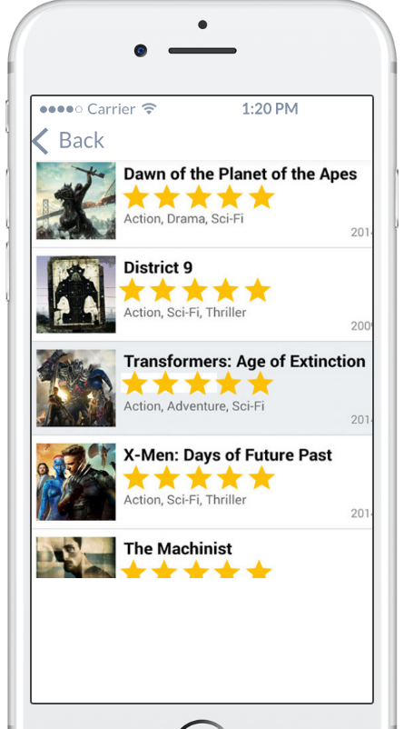
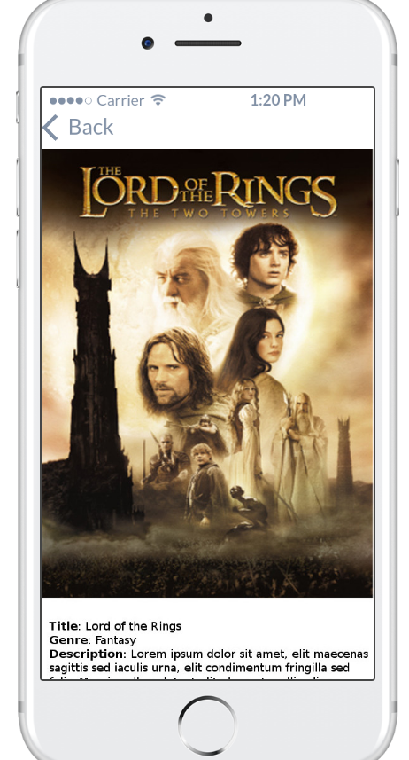

# ptc_ios_test

Jumia Porto Tech Center (PTC) is an Agile IT development center, with around 200 IT-specialists, 
where you will have the opportunity to participate in developing smart solutions for our group companies. 
We do e-commerce shops, logistics, business intelligence and mobile applications involving a wide range of high-end technologies for tens of millions customers.  

You can check our job opportunities at our site: https://group.jumia.com/careers.  

We were founded in 2012 and today we are part of Jumia Group powered by Rocket Internet, Millicom, MTN, Axa Group, 
Goldman Sachs, Orange and CDC.   Working at PTC means being in the first line of e-commerce development in emerging markets.  

What you will find in PTC?  

In PTC you will have an opportunity to develop and apply e-business software solutions for a wide range of business areas. 

You will belong to the international team with the top experts who will inspire and support you in working on an international scale impacting millions of revenue (travelling, logistics, e-shops) and users. 

We are humble and pragmatic. 

We are passionate about what we do, and we have fun while doing it. 

We move in a fast-pace and we are ready to challenge risks. 

We value sharing knowledge and learning from each other. We are flexible and we believe that anything is possible. 

We will offer you second home where you will find the opportunity for growth and career development.
You will have the opportunity to earn the bonus based on your excellent results. 
The benefit list includes but is not limited to health insurance, parental bonus, snacks and fruits.

This repo represents the current admission test that is needed to apply for an Android Developer Position.

***************************************************************************************************************
IOS Practical Admission Test Level 1
***************************************************************************************************************

Please create an app that is able to list movies by genre and by year.

The following requirements need to be met:

The application needs to have a splash screen, search screen,a list screen and a result detail screen.

The flow should be splash->search screen->list results-> result detail;

The list item structure should include:

- Title;
- Poster Image;
- Rating;
- Genre;
- Year;

*Simillar to*

The result detail should include:

- Title;
- Genre;
- Large Poster Image;
- Description;
- Year;

*Simillar to*

It has to use the following API - https://developers.themoviedb.org/3/getting-started/introduction

We recommend the following usages\implementations:

- Clear architectural pattern (MVP, MVVM, etc)
- AFNetworking http client;
- CocoaPods/Carthage

